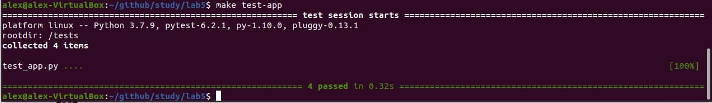
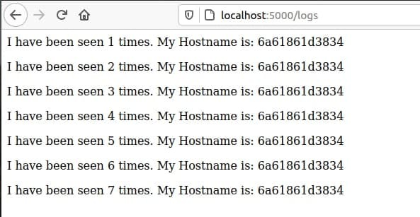
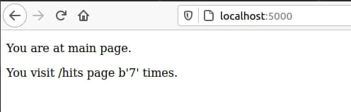

## Lab_5: Автоматизація за допомогою Makefile VS Docker Compose
1. Прочитав про docker-compose.
2. Прочитав про бібліотеку Flask. 
3. Створив робочий проект та скопіював необхідні файли.
4. Спробував чи проект є працездатним перейшовши у папку та після ініціалізації середовища виконав команди записані нижче:
    ```bash
    pipenv --python 3.7
    pipenv install -r requirements.txt
    pipenv run python app.py
    ```
5. Так само ініціалузував середовище для тестів у іншій вкладці шелу та запустив їх командою:
    ```bash
    pipenv run pytest test_app.py --url http://localhost:5000
    ```
6. Тести були невдалі тому що не було запущено redis-server та не було створено папку з файлом для логів. 
   Після виправлення помилок тести пройшли успішно:

   

7. Видалив непотрібні файли.
8. Ознайомився з вмістом Dockerfile та Makefile. Що означають директиви Makefile:  
    1)STATES - змінна для зберігання директив;  
    2)REPO - змінна для зберігання назви Docker репозиторію;  
    3).PHONY - дозволяє оголошувати фальшиві цілі;  
    4)$(STATES) - директива для білда контейнера;  
    5)run - директива для створення мережі;  
    6)test-app - директива для запуску контейнера з моніторингом;  
    7)docker-prune - видалення контейнерів, волюмів, мереж та імеджів.  
9. Запустив додаток та тест. Переконався, що тести пройшли успішно:

   

   Скріншоти сторінок:

   


   


   

10. Створив директиву `push` для завантаження імеджів у Docker Hub репозиторій.
11. Створив директиву `remove` для видалення усіх локальних імеджів.
12. Створив компоуз файл. У ньому створено дві мережі: public - мережа з якої можуть підключатись користувачі та  
    secret - для доступу до redis. Запустив `docker-compose`.
13. Веб-сайт працює. У браузері потрібно зайти на адресу localhost:80.
14. Компоуз створив 4 Docker імеджі:  
    bobas/lab4-examples   compose-tests  
    bobas/lab4-examples   compose-app  
    python                3.7-alpine  
    python                3.7-alpine  
15. Змінив тег імеджів на свій репозиторій та перезапустив `docker-compose`.
16. Перервав виконання проекту та почистив ресурси створенні компоуз.
17. З допомогою команди `docker-compose push`завантажив створені імеджі в репозиторій.
18. На мою думку набагато зручніше використувати `docker-compose` для створення, запуску імеджів та нетворгів.
19. Посилання на мій Docker репозиторій: https://hub.docker.com/repository/docker/alexolink/study.
20. Створив компоуз для лабораторної роботи №4 та запустив його.
