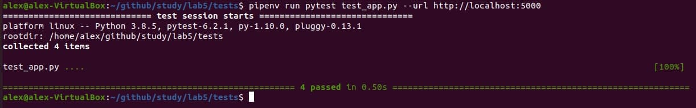

## Lab_5: Автоматизація за допомогою Makefile VS Docker Compose
1. Прочитав про docker-compose.
2. Прочитав про бібліотеку Flask. 
3. Створив робочий проект та скопіював необхідні файли.
4. Спробував чи проект є працездатним перейшовши у папку та після ініціалізації середовища виконав команди записані нижче:
    ```bash
    pipenv --python 3.7
    pipenv install -r requirements.txt
    pipenv run python app.py
    ```
5. Так само ініціалузував середовище для тестів у іншій вкладці шелу та запустив їх командою:
    ```bash
    pipenv run pytest test_app.py --url http://localhost:5000
    ```
6. Тести були невдалі тому що не було запущено redis-server та не було створено папку з файлом для логів. 
   Після виправлення помилок тести пройшли успішно:

   

7. Видалив непотрібні файли.
